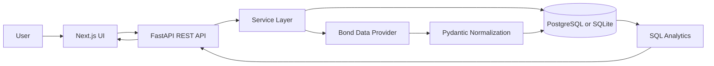

# YieldLens

YieldLens is a full-stack fixed-income analytics workspace for bond portfolios. It lets a user create portfolios, rename them, search or manually add bonds, import positions from CSV, inspect exposure and gain/loss, and run simplified interest-rate shock scenarios.

The project is intentionally built like a production MVP: a typed FastAPI backend owns data normalization, validation, persistence, and analytics; a Next.js frontend owns the user experience, workflows, charts, and API consumption.

Live deployments:

- GitHub Pages: https://nikhilmotwaniiii.github.io/YieldLens/
- Hosted backend API: https://yieldlens-bond-analytics.hbits.chatgpt.site/api
- Backend status page: https://yieldlens-bond-analytics.hbits.chatgpt.site

The public GitHub Pages frontend calls the hosted backend API for portfolio and position persistence. The ChatGPT-hosted root is intentionally only a backend status page with API links, not the product frontend. The local project in this repository still includes the FastAPI backend, database-backed dashboard, CSV import, API routes, provider layer, and tests.

## Quick Mental Model



In plain English:

1. The frontend asks the backend for portfolios, bond search results, analytics, or scenarios.
2. The backend validates requests with Pydantic schemas.
3. Services coordinate business logic.
4. SQLAlchemy persists normalized bonds and positions.
5. Analytics are calculated mostly with SQL aggregations.
6. The frontend renders the result as a bond desk-style dashboard.

## What The App Does

Core user flows:

- Open or create a portfolio.
- Rename a portfolio inline from the dashboard header.
- Add a bond from suggested/searchable demo data.
- Add a bond manually when the search universe does not contain it.
- Import positions from CSV with partial success and row-level validation.
- See portfolio value, gain/loss, weighted yield, average duration, and DV01.
- See exposure by credit rating, sector, issuer, and maturity bucket.
- See gain/loss contributors by position.
- Run interest-rate scenarios for fixed bps shocks.

Current default blank portfolio name:

- `New Bond Workspace`

Demo portfolio name:

- `Indian Bond Portfolio - Demo`

## Repository Map

```text
YieldLens/
|-- backend/
|   |-- app/
|   |   |-- api/              FastAPI route declarations and dependencies
|   |   |-- core/             settings, logging, exception handling
|   |   |-- data/             demo bond universe
|   |   |-- db/               SQLAlchemy base/session setup
|   |   |-- models/           database models
|   |   |-- providers/        bond data provider abstraction and implementations
|   |   |-- schemas/          Pydantic request/response contracts
|   |   |-- services/         business logic and analytics
|   |   `-- utils/            finance and ISIN helpers
|   |-- migrations/           Alembic migrations
|   `-- tests/                backend API and finance tests
|-- frontend/
|   |-- app/                  Next.js App Router pages/layout
|   |-- components/           dashboard, charts, drawers, UI primitives
|   |-- lib/                  API clients, formatting, validation, query provider
|   `-- types/                TypeScript API types
|-- docker-compose.yml        local Postgres + backend
|-- .env.example              documented environment variables
`-- .github/workflows/ci.yml  backend and frontend CI
```

## Tech Stack

Backend:

- Python 3.12+
- FastAPI
- Pydantic v2
- SQLAlchemy 2.x
- Alembic
- PostgreSQL in normal local/dev deployment
- SQLite in tests and lightweight preview runs
- Pandas for CSV parsing
- httpx for provider HTTP calls
- pytest and Ruff

Frontend:

- Next.js 15 App Router
- React 19
- TypeScript
- Tailwind CSS
- TanStack Query
- React Hook Form
- Zod
- Recharts
- Lucide icons
- Vitest

## Local Setup

### Option 1: Docker For Database And Backend

```bash
cp .env.example .env
docker compose up --build
```

Then run the frontend:

```bash
cd frontend
npm install
npm run dev
```

Open:

```text
http://localhost:3000
```

The backend docs are available at:

```text
http://localhost:8000/docs
```

### Option 2: Backend Directly

```bash
cd backend
python -m venv .venv
source .venv/bin/activate
pip install ".[dev]"
alembic upgrade head
uvicorn app.main:app --reload
```

### Frontend Directly

```bash
cd frontend
npm install
npm run dev
```

If the frontend ever shows a stale webpack/runtime chunk error during development, stop `npm run dev`, remove or move `frontend/.next`, and restart the dev server.

## Environment Variables

Backend:

- `DATABASE_URL`: SQLAlchemy database URL.
- `BACKEND_CORS_ORIGINS`: comma-separated allowed frontend origins.
- `BOND_PROVIDER`: `demo`, `indian`, or `hybrid`.
- `PROVIDER_TIMEOUT_SECONDS`: provider HTTP timeout.
- `SEARCH_CACHE_TTL_SECONDS`: backend cache TTL for bond search.
- `LIVE_BOND_SEARCH_URL`: optional configured JSON endpoint for live search.
- `LIVE_BOND_DETAIL_URL`: optional configured JSON endpoint for live detail lookup.
- `LIVE_BOND_API_KEY`: optional bearer token for a licensed/live provider.

Frontend:

- `NEXT_PUBLIC_API_BASE_URL`: browser-visible backend URL.

Important: the default app is demo-data first. Do not represent data as live unless a legitimate live provider endpoint is configured.

## Backend Architecture

### App Entry Point

File: `backend/app/main.py`

Responsibilities:

- Creates the FastAPI app.
- Registers CORS.
- Registers shared exception handlers.
- Mounts all `/api/v1` routers.
- Exposes `/health`.

### Settings

File: `backend/app/core/config.py`

`Settings` uses Pydantic Settings and reads from `.env`. `get_settings()` is cached with `lru_cache`, so settings are constructed once per process.

### Error Handling

The backend uses a custom `AppError` to raise structured application errors. Routes and services use it for predictable error responses such as:

- portfolio not found
- duplicate position
- unsupported CSV file type
- invalid scenario shock
- bond not found

### Dependency Injection

File: `backend/app/api/dependencies.py`

FastAPI dependencies build the database session and service instances. This keeps route functions thin and testable.

## Backend Data Model

### `portfolios`

File: `backend/app/models/portfolio.py`

Fields:

- `id`
- `name`
- timestamps from `TimestampMixin`

Relationship:

- one portfolio has many positions
- deleting a portfolio cascades to its positions

### `bonds`

File: `backend/app/models/bond.py`

One normalized bond-master row per ISIN.

Important fields:

- `isin`
- `issuer`
- `security_name`
- `coupon_rate`
- `maturity_date`
- `face_value`
- `currency`
- `credit_rating`
- `sector`
- `bond_type`
- `duration`
- `latest_price`
- `latest_yield`
- `price_source`
- `market_data_updated_at`
- provider metadata and raw provider payload

Why this table exists:

- Bond reference data should not be duplicated for every portfolio.
- Multiple portfolios can point to the same bond master row.
- Provider normalization happens once per ISIN.

### `portfolio_positions`

File: `backend/app/models/position.py`

Fields:

- `portfolio_id`
- `bond_id`
- `quantity`
- `purchase_price`
- `purchase_date`
- `manual_current_price`

Important constraint:

- `(portfolio_id, bond_id)` is unique, so a portfolio cannot contain duplicate rows for the same bond.

## Backend Services

### `PortfolioService`

File: `backend/app/services/portfolio_service.py`

Responsibilities:

- list portfolios
- create portfolios
- update portfolio names
- create or return the demo portfolio
- fetch portfolio detail with positions
- delete portfolios
- add/update/delete positions
- calculate each position's market value for read responses

Position valuation priority:

1. manual current price per unit
2. provider latest price per unit
3. purchase price per unit
4. face value fallback

### `BondSearchService`

File: `backend/app/services/bond_search_service.py`

Responsibilities:

- expose suggestions before the user types
- search bonds by query
- get bond detail by ISIN
- use the configured provider
- cache provider responses briefly
- upsert normalized bond reference rows

### `AnalyticsService`

File: `backend/app/services/analytics_service.py`

Responsibilities:

- portfolio value
- weighted coupon
- weighted yield with coverage
- weighted duration with coverage
- portfolio DV01
- unrealized gain/loss summary
- gain/loss contributors
- rating, sector, issuer exposure
- maturity distribution
- top positions

Most analytics are SQL-backed. This is intentional because aggregations should happen close to the data and avoid loading an entire portfolio into Python for every metric.

### `ScenarioService`

File: `backend/app/services/scenario_service.py`

Runs simplified interest-rate scenarios for:

- `-200`
- `-100`
- `-50`
- `+50`
- `+100`
- `+200`

Only positions with duration are included in scenario calculations. Coverage reports how much of the portfolio was eligible.

### `ImportService`

File: `backend/app/services/import_service.py`

Responsibilities:

- parse CSV files with Pandas
- validate rows
- import valid rows
- return row-level errors for invalid rows
- allow partial success

This means a file with 10 good rows and 2 bad rows can still import the 10 good rows.

## Bond Data Providers

Provider files:

- `backend/app/providers/base.py`
- `backend/app/providers/demo_provider.py`
- `backend/app/providers/indian_bond_provider.py`
- `backend/app/providers/hybrid_provider.py`

Provider modes:

- `demo`: uses curated local demo bond data.
- `indian`: calls a configured external JSON endpoint.
- `hybrid`: tries live/configured provider first, then falls back to demo data.

The app does not scrape protected exchanges or bypass authentication. If live market data is needed, configure a legitimate licensed or public JSON endpoint.

## API Surface

Base path:

```text
/api/v1
```

Health:

```http
GET /health
```

Bonds:

```http
GET /api/v1/bonds/suggestions
GET /api/v1/bonds/search?q=HDFC
GET /api/v1/bonds/{isin}
```

Portfolios:

```http
GET    /api/v1/portfolios
POST   /api/v1/portfolios
POST   /api/v1/portfolios/demo
GET    /api/v1/portfolios/{portfolio_id}
PUT    /api/v1/portfolios/{portfolio_id}
DELETE /api/v1/portfolios/{portfolio_id}
```

Positions:

```http
POST   /api/v1/portfolios/{portfolio_id}/positions
PUT    /api/v1/portfolios/{portfolio_id}/positions/{position_id}
DELETE /api/v1/portfolios/{portfolio_id}/positions/{position_id}
```

Analytics:

```http
GET /api/v1/portfolios/{portfolio_id}/analytics
```

Scenarios:

```http
POST /api/v1/portfolios/{portfolio_id}/scenarios/interest-rate
```

CSV import:

```http
GET  /api/v1/portfolios/{portfolio_id}/import/template
POST /api/v1/portfolios/{portfolio_id}/import
```

## Frontend Architecture

### App Router

Important files:

- `frontend/app/layout.tsx`: root layout and React Query provider.
- `frontend/app/page.tsx`: landing page.
- `frontend/app/portfolio/[id]/page.tsx`: portfolio route.
- `frontend/app/portfolio/[id]/loading.tsx`: portfolio loading state.
- `frontend/app/portfolio/[id]/error.tsx`: portfolio error state.

### API Client Layer

Files:

- `frontend/lib/api/client.ts`
- `frontend/lib/api/portfolios.ts`
- `frontend/lib/api/bonds.ts`
- `frontend/lib/api/analytics.ts`

The frontend does not call `fetch` directly throughout components. It uses small API helpers so endpoint details stay centralized.

### State Management

TanStack Query handles server state:

- fetching portfolio detail
- fetching analytics
- invalidating analytics after position changes
- invalidating portfolio data after rename
- running scenario queries by selected shock

Local React state handles UI-only state:

- drawer open/closed
- CSV dialog open/closed
- active bond search row
- selected bond
- inline portfolio-name edit state
- scenario shock selection

### Forms And Validation

React Hook Form manages add-bond and manual-entry forms.

Zod schemas live in:

```text
frontend/lib/validation/position.ts
```

Backend validation remains authoritative, but frontend validation gives users quicker feedback.

### UI Components

Key components:

- `PortfolioDashboard`: main dashboard shell, metrics, header actions, inline rename.
- `MetricCard`: reusable top metric tile.
- `AddBondDrawer`: search, suggestions, selected bond summary, manual bond entry.
- `CsvImportDialog`: CSV template download and upload.
- `ScenarioPanel`: interest-rate shock controls and largest impacts.
- `ExposureChart`: rating/sector pie charts.
- `MaturityChart`: maturity bucket bar chart.
- `GainLossChart`: unrealized gain/loss contributor chart.

### Design System

The current UI direction is a professional bond desk / fixed-income console:

- dark command header
- warm ivory panels
- teal/brass/copper accents
- explicit profit/loss colors
- compact, dashboard-first information density

Shared colors and shadows are defined in:

```text
frontend/tailwind.config.ts
```

Global typography, background texture, and focus states are in:

```text
frontend/app/globals.css
```

## Analytics Methodology

This section is useful for interviews because it explains both the finance and the implementation choices.

### Market Value

```text
market value = quantity x valuation price per unit
```

Valuation price priority:

1. `manual_current_price`
2. `bond.latest_price`
3. `purchase_price`
4. `bond.face_value`

Why this matters:

- Users may have their own current price.
- Providers may have a reference/latest price.
- If neither exists, purchase price is a reasonable portfolio-cost fallback.
- Face value is the last fallback so analytics do not crash on missing prices.

### Portfolio Value

```text
portfolio value = sum(position market value)
```

This is displayed as a full INR value, not compacted into K/L/Cr, because it is a top-line money number.

### Cost Basis

```text
cost basis = quantity x purchase price per unit
```

Only positions with purchase price can contribute to cost basis.

### Unrealized Gain/Loss

```text
unrealized gain/loss = market value - cost basis
```

Gain/loss percent:

```text
gain/loss percent = unrealized gain/loss / cost basis x 100
```

Gain/loss coverage:

```text
coverage = market value of positions with purchase price / total portfolio value x 100
```

Coverage answers: "How much of the portfolio could we calculate gain/loss for?"

It is not the gain/loss percent.

### Weighted Coupon

```text
weighted coupon = sum(market value x coupon rate) / total portfolio value
```

This answers: "What coupon rate does the portfolio look like after weighting by position size?"

### Weighted Yield

```text
weighted yield = sum(eligible market value x latest yield) / eligible market value
```

Only positions with `latest_yield` are eligible. Coverage tells you how much of the portfolio had yield data.

### Weighted Duration

```text
weighted duration = sum(eligible market value x duration) / eligible market value
```

Only positions with duration are eligible. Coverage tells you how much of the portfolio had duration data.

### DV01

```text
DV01 = market value x duration x 0.0001
```

DV01 estimates how much money the position or portfolio changes for a 1 basis point yield move.

One basis point is:

```text
1 bp = 0.01 percentage points = 0.0001 as a decimal
```

### Maturity Distribution

Buckets:

- `< 1 year`
- `1-3 years`
- `3-5 years`
- `5-10 years`
- `10+ years`

Each bucket shows the market value and percentage of portfolio value that matures in that window.

### Interest-Rate Scenario

The scenario uses a simplified duration approximation:

```text
estimated price change percent = -duration x yield change
```

Where:

```text
yield change = shock_bps / 10000
```

Example:

```text
100 bps = 1 percentage point = 0.01
duration = 4
estimated price change = -4 x 0.01 = -4%
```

So when rates rise, bond prices usually fall. When rates fall, bond prices usually rise.

This is intentionally simplified and is not a full institutional bond-pricing model.

## CSV Import

Template columns:

```csv
isin,issuer,security_name,coupon_rate,maturity_date,face_value,quantity,purchase_price,current_price,duration,rating,sector
```

Notes:

- Valid rows are imported even if some rows fail.
- Invalid rows are returned with row number, field, and message.
- The upload size is capped for the MVP.
- Only CSV uploads are supported.

## Testing And Quality

Backend:

```bash
cd backend
ruff check .
pytest
```

Frontend:

```bash
cd frontend
npm run lint
npm run typecheck
npm run test
npm run build
```

CI runs:

- backend dependency install
- Ruff
- pytest
- frontend npm install
- ESLint
- TypeScript typecheck
- Vitest
- Next.js production build

## Interview Prep: How To Explain The Project

### One-Minute Pitch

YieldLens is a full-stack bond portfolio analytics app. I built a FastAPI backend with a normalized bond master, portfolio positions, provider abstraction, CSV import, and SQL-backed analytics. The frontend is a Next.js dashboard that lets users create and rename portfolios, add bonds, inspect exposure and gain/loss, and run simplified interest-rate shock scenarios. The architecture separates UI state, API contracts, business logic, provider normalization, and database analytics so each layer is testable and replaceable.

### Why FastAPI?

- Strong typing with Pydantic.
- Automatic OpenAPI docs.
- Lightweight service/dependency structure.
- Good fit for data-heavy APIs.

### Why SQLAlchemy?

- Explicit relational model.
- SQL aggregation support for analytics.
- Works with PostgreSQL in normal deployment and SQLite in tests.

### Why A Provider Abstraction?

Bond data may come from demo data, a licensed vendor, or a public endpoint. The app should not care which provider is active. Everything is normalized into the same `BondReferenceData` shape.

### Why Calculate Analytics In SQL?

Metrics like exposure, weighted duration, and portfolio value are aggregations over persisted positions. SQL is better suited for this than fetching all rows and looping in the application layer, especially as portfolios grow.

### Why Report Coverage?

Financial data is often incomplete. Coverage makes missing data explicit. For example, if only 60% of the portfolio has duration, the weighted duration and scenario output should say that clearly.

### What Would You Improve Next?

High-impact next steps:

- Portfolio list / recent portfolios screen.
- Authentication and user isolation.
- Durable hosted database setup.
- Better position editing from the table.
- More robust live bond data integration through a licensed provider.
- Historical price/yield tracking.
- Cashflow schedule and accrued interest.
- More complete bond pricing with yield curve assumptions.
- Stronger frontend component tests.
- Pagination for large portfolios.

## Known Limitations

- Default data is demo/reference data, not live market data.
- Live data requires a configured legitimate JSON provider.
- No authentication or multi-user isolation yet.
- Local preview may use a temporary SQLite database, so data can disappear if the temp DB is cleared.
- Scenario analysis is duration-based and simplified.
- No accrued interest, cashflow calendar, convexity, tax treatment, or full yield-curve pricing yet.
- Portfolio discovery is still basic; portfolios exist in the backend, but a polished "My Portfolios" screen is a future improvement.

## Deployment Notes

Potential deployment shape:

- Frontend: Vercel or any Next.js-compatible host.
- Backend: Render, Railway, Fly.io, ECS, or another container host.
- Database: Neon, Supabase, Railway, Render PostgreSQL, or another managed PostgreSQL provider.

Production checklist:

- Set `DATABASE_URL` to a durable PostgreSQL database.
- Run Alembic migrations.
- Configure `BACKEND_CORS_ORIGINS`.
- Set `NEXT_PUBLIC_API_BASE_URL`.
- Decide whether `BOND_PROVIDER` is `demo`, `indian`, or `hybrid`.
- Configure live provider URLs/API key only if legally available.
- Add authentication before real multi-user use.

## Glossary

- Bond: a debt security where an issuer borrows money and pays interest.
- ISIN: a 12-character security identifier.
- Coupon: stated annual interest rate of the bond.
- Yield: estimated return based on price and cashflows.
- Duration: approximate price sensitivity to interest-rate changes.
- Basis point: 0.01 percentage points.
- DV01: estimated money change for a 1 bp yield move.
- Face value: principal amount used as the bond's reference value.
- Market value: current value of the position.
- Cost basis: purchase cost of the position.
- Unrealized gain/loss: current value minus cost basis.
- Coverage: percentage of portfolio value eligible for a metric.

## Disclaimer

YieldLens is an educational analytics project. Market data may be delayed, incomplete, demo-only, or unavailable. Analytics are simplified estimates and do not constitute investment advice.

YieldLens is not affiliated with BlackRock, NSE, BSE, or any bond-data provider.
